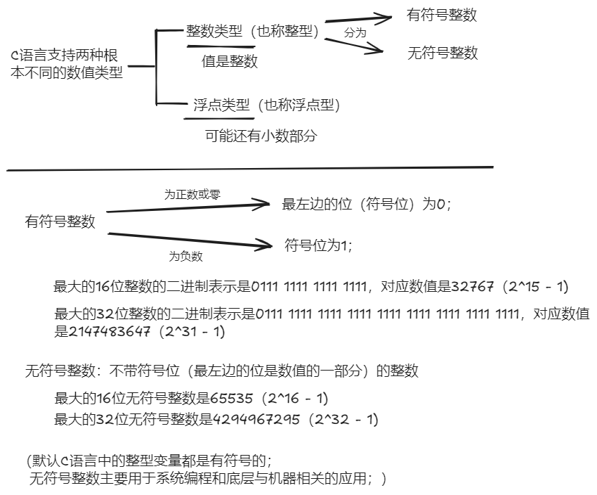

# C语言程序设计 现代方法

[美]K.N.金（K. N. King）

###### TODO:

```
六章
```

## 第一章 C语言概述

### 1.1 C语言的历史

#### 1.1.1 起源


#### 1.1.2 标准化

K&B -> C89/C90 -> C99 -> C11 -> C18

#### 1.1.4 基于C的语言

- C++：包括了所有C的特性，增加了类和其他特性以支持面向对象编程
- Java：基于C++
- C#：由C++和Java发展起来
- Perl：最初是一种简单的脚本语言，发展过程中采用了C的许多特性

### 1.2 C语言的优缺点

源于C语言的最初用途（编写操作系统和其他系统软件）和自身的基础理论体系.

- C语言是一种底层语言：C 语言提供了对机器级概念（如字节和地址）的访问（为了适应系统编程的需要）、与计算机内置指令紧密协调的操作，使得程序可以快速执行.
- C语言是一种小型语言：为了保持较少量的特性，C语言在很大程度上依赖一个标准函数的“库”.
- C语言是一种包容性语言：C语言提供了比其他许多语言更高的自由度，此外C语言不像其他语言那样强制进行详细的错误检查.

#### 1.2.1 C语言的优点

- 高效：发明C语言就是为了编写那些以往由汇编语言编写的应用程序
- 可移植：C程序具有可移植性的一个原因是该语言没有分裂成不兼容的多种分支（归功于C语言早期与UNIX系统的结合以及后来的ANSI/ISO标准）；另一个原因是C语言编译器规模小且容易编写；C语言自身的特性也支持可移植性（尽管它没有阻止程序员编写不可移植的程序）
- 功能强大：C语言拥有一个庞大的数据类型和运算符集合，使得C语言具有强大的表达能力
- 灵活：C语言现在可以用于编写从嵌入式系统到商业数据处理的各种应用程序；C语言在其特性使用上的限制非常少，在其他语言中认定为非法的操作在C语言中往往是允许的，如C语言允许一个字符与一个整数值/浮点数相加
- 标准库：~包含了数百个可以用于输入/输出、字符串处理、存储分配以及其他实用操作的函数
- 与UNIX系统的集成：C语言在与UNIX系统（包括Linux）结合方面特别强大

#### 1.2.2 C语言的缺点

C语言的缺点和它的许多优点是同源的，均来自C语言与机器的紧密结合

- C程序更容易隐藏错误
- C程序可能会难以理解
- C程序可能会难以修改

---

C语言混乱代码大赛（International Obfuscated C Code Contest, IOCCC） 1991年的“最佳小程序”

功能是打印出八皇后问题的全部解决方案

```c
v,i,j,k,l,s,a[99];
main()
{
    for(scanf("%d",&s);*a-s;v=a[j*=v]-a[i],k=i<s,j+=(v=j<s&&
(!k&&!!printf(2+"\n\n%c"-(!l<<!j)," #Q"[l^v?(l^j)&1:2])&&
++l||a[i]<s&&v&&v-i+j&&v+i-j))&&!(l%=s),v||(i==j?a[i+=k]=0:
++a[i])>=s*k&&++a[--i])
    ;
}
```

---

#### 1.2.3 高效地使用C语言

- 学习如何避免C语言的缺陷：可以参考《C陷阱与缺陷》
- 使用软件工具使程序更加可靠：lint可以对程序进行更加广泛的错误分析，一般由UNIX系统提供
- 利用现有的代码库
- 采用一套切合实际的编码规范：采纳某些规范并且坚持使用它们
- 避免“投机取巧”和极度复杂的代码：编码应该相当简洁但仍然易于理解
- 紧贴标准：若非却有必要，最好避免使用C编译器提供的不属于C89、C99或C1X标准的特性和库函数

## 第二章 C语言基本概念

### 2.1 编写一个简单的C程序

程序：显示双关语

---

pun.c

```c
#include <stdio.h>

int main(void)
{
    printf("To c, or not to C: that is the question.\n");
    return 0;
}
```

#### 2.1.1  编译和链接

运行需要把pun.c程序转化为机器可以执行的形式，对C程序来说，转化通常包含下列3个步骤：

- 预处理：首先程序被交给预处理器（preprocessor），~执行以#开头的命令（通常称为指令）；预处理器有点类似于编辑器，它可以给程序添加内容，也可以修改程序
- 编译：修改后的程序进入编译器，~把程序翻译成机器指令（即目标代码），这时程序还是不可运行的
- 链接：最后，链接器（linker）把由编译器产生的目标代码和所需的其他附加代码整合到一起，产生完全可执行的程序；这些附加代码包括程序中用到的库函数（如printf函数）


上述过程往往是自动实现的；预处理器通常会和编译器集成在一起

UNIX系统中通常把C编译器命名为 cc ，编译和链接pun.c程序需要在终端或命令行窗口输入：

```
% cc pun.c
```

（字符 % 是UNIX系统的提示符，不需要输入）使用编译器 cc 时，系统自动进行链接操作；编译和链接好后，编译器cc会把可执行程序放到默认名为a.out的文件中；编译器cc的 -o 选项允许为含有可执行程序的文件选择 名字

```
% cc -o pun pun.c
```

---

GCC

GCC是最流行的C编译器之一，随Linux发行，使用与传统的UNIX cc编译器相似

```
% gcc -o pun pun.c
```

GCC最初是GNU C Compiler的简称，现指GNU Compiler Collection，因为最新版GCC能编译用Ada, C, C++, Fortran, Java和Objective-C等多种语言编写的程序

GCC由多个命令行选项来控制程序检查的彻底程度

- -Wall                                      使编译器在检测到可能的错误时生成警告消息（-W  后面可以加上具体的警告代码
                                                              -Wall 表示“所有的-W选项”）为了获得最好的效果，-Wall应与-O选项结合使用
- -W                                            除了-Wall生成的警告消息外，还需要针对具体情况的额外警告消息
- -pedantic                              根据C标准的要求生成警告消息。这样可以避免在程序中使用非标准特性
- -ansi                                        禁用GCC的非标准C特性，并启用一些不太常用的标准特性
- -std=c89或-std=c99        指明使用哪个版本的C编译器来检查程序

这些选项通常可以结合使用：

```
% gcc -O -Wall -W -pedantic -std=c99 -o pun pun.c
```

#### 2.1.2集成开发环境

集成开发环境（integrated development environment, IDE）是一个软件包，可以在其中编辑、编译、链接、执行甚至调试程序

### 2.2 简单程序的一般形式

简单的C程序一般具有如下形式：

```c
指令

int main(void)
{
    语句
}
```

即使是最简单的C程序也依赖3个关键的语言特性：

- 指令（在编译前修改程序的编辑命令）
- 函数（被命名的可执行代码块，如main函数）
- 语句（程序运行时执行的命令）

#### 2.2.1 指令

预处理器执行的命令称为指令

\#include <stdio.h>这条指令说明，在编译前把<stdio.h>中的信息“包含”到程序中

<stdio.h>包含C标准输入/输出库的信息

C语言拥有大量类似于<stdio.h>的头（header），每个头都包含一些标准库的内容

C语言没有内置的“读”和“写”命令，输入/输出功能由标准库中的函数实现

所有指令都是以字符#开头的，#可以把C程序中的指令和其他代码区分开，指令默认占一行，结尾没有分号或其他特殊标记

#### 2.2.2 函数

函数分为两大类：一类是程序员编写的函数，另一类是作为C语言实现的一部分提供的函数，后者称为库函数（library function），因为他们属于一个由编译器提供的函数“库”

计算数值的函数用return语句来指定所“返回”的值

一个C程序可以包含多个函数，但只有main函数是必须有的，在执行程序时系统会自动调用main函数；main函数会在程序终止时向操作系统返回一个状态码。

语句 return 0 有两个作用：一是使 main 函数终止（从而结束程序），二是指出main函数的返回值是0；当exit(0)语句出现在main函数中时和return 0语句等价

如果main函数的末尾没有return语句，程序仍然能终止，但许多编译器会产生一条警告信息；在C89中，返回给操作系统的值是未定义的，在C99中，如果main函数声明中的返回类型是int，程序会向操作系统返回0，否则程序会返回一个不确定的值

#### 2.2.3 语句

语句是程序运行时执行的命令，程序pun.c只用到两种语句：一种时返回（return）语句，另一种时函数调用（function call）语句；要求某个函数执行分派给它的任务称为调用这个函数。

C语言规定每条语句都要以分号结尾（复合语句不以分号结尾），指令通常只占一行不需要用分号结尾

#### 2.2.4 显示字符串

字面串（string literal）是用一对双引号包围的一系列字符

printf函数不会自动跳转到下一输出行，需要在要显示的字符串中包含 \n（换行符）

```
printf("To C, or not to C: that is the question.\n");
//效果等同于
printf("To C, or not to C: ");
printf("that is the question.\n");
```

换行符可以在一个字面串中出现多次：

```
printf("Brevity is the soul of wit.\n  --ShakeSpeare\n");
//Brevity is the soul of wit.
//  --Shakespeare
```

### 2.3 注释

每一个程序都应该包含识别信息，即程序名、编写日期、作者、程序的用途以及其他相关信息，C语言把这类信息放在注释（comment）中；符号 /* 标记注释的开始，符号 /* 标记注释的结束

```
/* This is a comment */
```

注释几乎可以出现在程序的任何位置上，可以独占一行，也可以和其他程序文本出现在同一行中

注释还可以占用多行：

```
/* Name: pun.c
   Purpose: Prints a bad pun.
   Author: K. N. King
*/
```

C99提供了另一种类型的注释，以 // （两个相邻的斜杠）开始，这种会在行末自动终止

```
// This is a comment
```

传统风格的注释/\*...\*/不允许嵌套，C99（//）注释可以嵌套在传统风格注释中

### 2.4 变量和赋值

在程序执行过程中临时存储数据的这类存储单元被称为变量（variable）

#### 2.4.1 类型

每一个变量必须有一个类型（Type），用来说明变量所存储的数据的种类

int（integer的简写）型变量可以存储整数，如0、1、392或-2553，但取值 范围是受限制的，最大整数通常为2 147 483 647，某些计算机上也可能是32 767

float（即floating-point的简写）型变量可以存储比int型变量大得多的数值，并且可以存储带小数位的数，如379.125；float型变量所存储的值往往只是实际数值的一个近似值

#### 2.4.2 声明

在使用变量之前必须对其进行声明（为编译器所作的描述），首先指定变量的类型，然后说明变量的名字

```
int height;
float profit;
```

如果几个变量有相同的类型可以把它们的声明合，每一条完整的声明都要以分号结尾

```
int height, length, width, volume;
float profit, loss;
```

当main函数包含声明时，必须把声明放置在语句之前：

```
int main(void)
{
    声明
    语句
}
```

在C99中，声明可以不在语句之前

#### 2.4.3 赋值

变量通过赋值（assignment）的方式获得值

```
height = 8;
length = 12;
width = 10;
```

把数值8...分别赋值给height...；8, 12, 10称为常量（constant）

变量在赋值或以其他方式使用之前必须先声明：

```
int height;
height = 8;
//------------------
height = 8;    /** WRONG **/
int height;
```

当把一个包含小数点的常量赋值给float型变量时，最好在该常数后面加一个字符 f（代表float）；包含小数点但不以f结尾的常量是double（double precision的缩写）型的，double型的值比float型的值存储得更加精确，并且比float型的值大，如果在给float型变量赋值时不加f，编译器可能会生成一条警告消息告诉你存储到float型变量中的数可能超出了该变量的取值范围

```
profit = 2150.48f
```

混合类型赋值（例如把int型的 值赋给float型变量，或反过来）是可以的，但不一定安全

赋值运算的右侧可以是一个含有常量、变量和运算符的公式（在C语言的术语中称为表达式）

#### 2.4.4 显示变量的值

```
printf("Height: %d\n", height);
```

占位符%d用来指明在显示过程中变量height的值的显示位置。

%d仅用于int型变量；%f用于float型变量，默认显示小数点后6位数字，如果要强制%f显示小数点后p位数字，可以把 .p放置在%和 f 之间

```c
printf("Profit: $%.2f\n", profit);	//Profit: $2150.48
```

#### 2.4.5 初始化

当程序开始执行时，某些变量会被自动设置为零，而大多数变量则不会；没有默认值并且尚未在程序中被赋值的变量是未初始化的（uninitialized）

> 如果试图访问未初始化的变量，可能会得到不可预知的结果，如258、-30 891或者其他没有意义的数值，在某些编译器中可能是发生更坏的情况（甚至是程序崩溃）

除了采用赋值的方法给变量赋初始值，更简便的方法是：在变量声明中加入初始值

```c
int height = 8;
int height = 8, length = 12, width = 10;
int height, length, width = 10;	//只有变量width拥有初始化器10，height和length都没有
```

按照C语言的术语，数值8是一个初始化器（initializer）

#### 2.4.6 显示表达式的值

printf的功能不局限于显示变量中存储的数，它可以显示 任意数值表达式 的值，利用这一特性可以简化程序和减少变量的数量

```c
volume = height * length * widht;
printf("%d\n", volume);
//可以用以下形式代替
printf("%d\n", height * length * widht);
```

printf显示 表达式的值 的能力说明了C语言的一个通用原则：在任何需要数值的地方都可以使用具有相同类型的表达式

### 2.5 读入输入

scanf中的字母f和printf中的字母f含义相同，都表示“格式化”的意思，scanf函数和printf函数都需要使用 格式串（format string）来指定输入数据或输出数据的形式

```c
scanf("%d", &i);	/* reads an integer; stores into i */
scanf("%f", &x);	/* reads a float value; stores into x */
```

### 2.6 定义常量的名字

当程序含有常量时，建议给这些常量命名，以后阅读程序时也许会不明白这些常量的含义，可以采用称为 宏定义（macro definition）的特性给常量命名，还可以利用宏来定义表达式

```c
#define INCHES_PER_POUND 166
#define RECIPROCAL_OF_PI (1.0f / 3.14159f)
```

当宏包含运算符时，建议用括号 () 把表达式括起来；注意宏的名字只用大写字母，这是C程序员沿用了几十年的规范，但并不是C语言本身的要求。

这里的 #define 是预处理指令，类似于 #include，因此行尾也没有分号，当对程序进行编译时，预处理器会把每一个宏替换为其表示的值

```c
weight = (volume + INCHES_PER_POUND - 1) / INCHES_PER_POUND;
// 将变为
weight = (volume + 166 - 1) / 166;
```

程序：华氏温度转换为摄氏温度

---

提示用户输入一个华氏温度，然后输出一个对应的摄氏温度

celsius.c

```c
/* Converts a Fahrenheit temperature to Celsius */

#include <stdio.h>

#define FREEZING_PT 32.0f
#define SCALE_FACTOR (5.0f / 9.0f)

int main(void)
{
    float fahrenheit, celsius;
    
    printf("Enter Fahrenheit temperature: ");
    scanf("%f", &fahrenheit);
    
    celsius = (fahrenheit - FREEZING_PT) * SCALE_FACTOR;
    
    printf("Celsius equivalent: %.1f\n", celsius);
    
    return 0
}
```

在定义SCALE_FACTOR时，表达式采用 (5.0f / 9.0f) 的形式而不是 (5 / 9) 的形式是因为，如果两个整数相除C语言会对结果向下舍入，表达式 (5 / 9) 的值是0

### 2.7 标识符

在编写程序时，需要对变量、函数、宏和其他实体进行命名，这些名字称为 标识符（identifier）

在C语言中，标识符可以含有字母、数字和下划线，但是必须以字母或者下划线开头

【C99中，标识符还可以使用某些“通用字符名】

合法标识符的示例： times10    get_next_char    _done

不合法的标识符：10times    get-next-char

C语言是区分大小写的，C语言对标识符的最大长度没有限制

标识符规范：

1. 只使用小写字母（常见于传统C）：symbol_table    current_page    name_and_address
2. 避免使用下划线，将每个单词用大写字母开头：symbolTable    currentPage    nameAndAddress

###### 关键字

关键字（keyword）对C编译器有着特殊的意义，因此这些关键字不能作为标识符来使用；下面有些关键字是C99新增的，有些是C1X新增的

|   auto   |      extern      |  short   |         while          |
| :------: | :--------------: | :------: | :--------------------: |
|  break   |      float       |  signed  |    _Alignas   (C11)    |
|   case   |       for        |  sizeof  |    _Alignof   (C11)    |
|   char   |       goto       |  static  |    _Atomic   (C11)     |
|  const   |        if        |  struct  |     _Bool   (C99)      |
| continue |  inline   (C99)  |  switch  |    _Complex   (C99)    |
| default  |       int        | typedef  |    _Generic   (C11)    |
|    do    |       long       |  union   |   _Imaginary   (C99)   |
|  double  |     register     | unsigned |   _Noreturn   (C11)    |
|   else   | restrict   (C99) |   void   | _Static_assert   (C11) |
|   enum   |      return      | volatile | _Thread_local   (C11)  |

### 2.8 C程序的书写规范

C语言允许在记号（token，即许多在不改变意思的情况下无法再分割的字符组）之间插入任意数量的间隔，有着以下意义

- 语句可以分开放在任意多行内，例如较长语句

  ```c
  printf("Dimensional weight (pounds): %d\n",
        (volume + INCHES_PER_POUND - 1) / INCHES_PER_POUND);
  ```

- 记号间的空格更容易区分记号，通常在每个运算符的前后都放上一个空格；逗号后边放一个空格

  ```
  volume = height * length * width;
  ```

- 缩进有助于轻松识别程序嵌套（可以缩进3个或4个空格）

- 空行可以把程序划分成逻辑单元，从而使读者更容易辨别程序的结构

把换行符加进字符串中（换句话说，就是把字符串分成两行）是非法的：

```c
printf("To C, or not to C:
that is the question.\n");	/*** WRONG ***/
```

## 第3章 格式化输入/输出

### 3.1  printf函数

printf函数被设计用来显示 格式串（format string）的内容，并在该串中的指定位置插入可能的值。

调用printf函数时必须提供格式串，格式串后面的参数是需要在显示时插入到该串中的值：

```c
printf(格式串， 表达式1， 表达式2， ...);
```

显示的值可以是常量、变量或者更加复杂的表达式


格式串包含普通字符和 转换说明（conversion specification），其中转换说明以字符%开头；转换说明是用来表示打印过程中待填充的值的占位符，跟随在字符%后面的信息指定了把数值从内部形式（二进制）转换成打印形式（字符）的方法

例如，转换说明%d指定printf函数把int型值从二进制形式转换成十进制数字组成的字符串

> C语言编译器不会检测格式串中转换说明的数量是否和输出项的数量相匹配
>
> 也不检测转换说明是否适合要显示项的数据类型
>
> ```c
> // 转换说明的数量多于要显示的值的数量：
> // 变量i的值将正确显示，接着显示另一个（无意义的）整数值
> printf("%d %d\n", i);
> 
> // 函数调用带有太少的转换说明：
> // 会显示变量i的值，但是不显示变量j的值
> printf("%d\n", i, j);
> 
> // 因为printf函数必须服从于格式串，所以它将如实地显示出一个float型值，接着是一个int型值，但两个值都是无意义的
> printf("%f %d\n", i, x);
> ```

#### 3.1.1 转换说明

```
%m.pX
-%m.pX
```

m和p都是整形常量，X是字母；m和p都是可选的；如果省略p，m和p之间的小数点也要去掉

```
%10.2f   // m是10，p是2，X是f
%10f   // m是10，p（连同小数点一起）省略了
%.2f   // p是2，m省去了
```

**最小栏宽**（minimum field width）m指定了要显示的最小字符数量

如果要显示的数值所需的字符数少于m，那么值在字段内是右对齐的（也就是在前面放置额外的空格）

```
%4d   //将以·123的形式显示数字124（这里符号·表示空格字符）
```

如果要显示的值所需的字符数多于m，那么栏宽会自动扩展为所需的尺寸

```
%4d   //将以12345的形式显示12345，不会丢失数字
```

在m前面放上一个负号会导致左对齐

```
%-4d   //将以123·的形式显示123
```

**精度**（precision）p依赖于 转换指定符（conversion specifier）X的选择，X表面在显示数值前需要对其进行那种转换

常用的转换指定符：

- d   -   表示十进制（基数为10）形式的整数，p指明了待显示数字的最小个数（必要时在数字前加上额外的零）；如果省略p，则默认它的值为1
  （在printf格式串中使用%i和%d没有，但是在scanf格式串中，%d只能与十进制形式的整数相匹配，而%i则可以匹配用八进制、十进制或十六进制表示的整数；如果输入的数有前缀0，那么%i会把它当作八进制数来处理，0x或0X是十六进制）
- e   -   表示指数（科学计数法）形式的浮点数，p指明了小数点后应该出现的数字个数（默认值为6），如果p为0，则不显示小数点。
- f   -   表示“定点十进制”形式的浮点数，没有指数；p的含义与说明符e中的一样
- g   -   表示指数形式或定点十进制形式的浮点数，形式的大小根据数的大小决定；p意味着可以显示的有效数字（不是小数点后的数字）的最大数量；与转换指定符f不同，g的转换将不显示尾随的零，此外，如果要显示的数值没有小数点后的数字，g就不会显示小数点

编写程序时无法预知数的大小或者数值的变化范围很大的情况下，说明符g对于数的显示是特别有用的；数值适中时，说明符g采用定点十进制形式，非常大或非常小的数时，说明符g会转换成指数形式以便减少所需的字符数

```c
/* prints int and float values in various formats */

#include <stdio.h>

int main(void)
{
    int i;
    float x;
    
    i = 40;
    x = 893.21f;
    
    printf("|%d|%5d|%-5d|%5.3d|\n", i, i, i, i);
    printf("|%10.3f|%10.3e|%-10g|\n", x, x, x);
    
    return 0;
}

// |40|   40|40   |  040|
// |   893.210| 8.932e+02|893.21    |
```

#### 3.1.2 转义序列

转义序列（escape sequence）使字符串包含一些特殊字符而不会使编译器引发问题，这些字符包括非打印的（控制）字符和对编译器有特殊含义的字符（如"，标记字符串的开始和结束）

例子：

- 警报（响铃）符： \\a
- 回退符： \\b
- 换行符： \\n
- 水平制表符： \t
- \\"
- \\\

### 3.2 scanf函数

许多专业的C程序员会避免使用scanf函数，而是采用字符格式读取所有数据，然后再把它们转换成数值形式

#### 3.2.1 scanf函数的工作方法

调用时，scanf函数从左边开始处理字符串中的信息。对于格式串中的每一个转换说明，scanf函数从输入的数据中定位适当类型的项，并在必要时跳过空格。然后，scanf函数读入数据项，并且在遇到不可能属于此项 的字符时停止。如果读入数据项成功，那么scanf函数会继续处理格式串的剩余部分；如果某一项不能成功读入，那么scanf函数将不再查看格式串的剩余部分（或者余下的输入数据），并立即返回。

在寻找数的起始位置时，scanf函数会忽略 空白字符（white-space character，包括空格符、水平和垂直制表符、换页符和换行符）；

scanf函数“忽略”输入的字符流最后一个换行符，实际上没有读取它；这个换行符将是下一次scanf函数调用的第一个字符。

当scanf函数遇到一个不可能属于当前项的字符时，它会把此字符“放回原处”，以便在扫描下一个输入项或者下一次调用scanf函数时再次读入。（关于“放回原处”：用户从键盘输入时，程序并没有读取输入，而是把用户的输入放在一个隐藏的缓冲区中，由scanf函数来读取。scanf函数把字符放回到缓冲区中供后续读取是非常容易的）

#### 3.2.2 格式串中的普通字符

处理格式串中的普通字符时，scanf函数采取的动作依赖于这个字符是否为空白字符

- 空白字符：当在格式串中遇到一个或多个连续的空白字符时，scanf函数从输入中重复读空白字符，直到遇到一个非空白字符（把该字符“放回原处”）为止；格式串中的一个空白字符可以与输入中任意数量的空白字符相匹配，包括零个.
- 其他字符：当在格式串中遇到非空白字符时，scanf函数把它与下一个输入字符进行比较；如果两个字符相匹配，那么scanf函数会放弃输入字符，并继续处理格式串；如果两个字符不匹配，那么scanf函数会把不匹配的字符放回输入中，然后异常退出，而不进一步处理格式串或者从输入中读取字符

> e.g.
>
> 假设格式串是"%d/%d"
>
> 如果输入是：  ·5/·96
>
> 在寻找整数时，scanf函数会跳过第一个空格，把%d与5相匹配，把/与/相匹配，在寻找下一个整数时跳过第一个空格，并且把%d与96相匹配
>
> 如果输入时：  ·5·/·96
>
> scanf函数会跳过第一个空格，把%d与5相匹配，然后试图把格式串中的/与输入中的空格相匹配，但是二者不匹配，因此scanf函数把空格放回原处，把字符·/·96留给下一次scanf函数调用来读取；为了允许第一个数后面有空格，应使用格式串"%d /%d"

（如果用户在两个数之间加入了标点符号（如逗号），scanf函数如何处理？

例子：scanf("%d%d", &i, &j);

用户输入：4, 28

scanf函数将读取4并且把它存储在变量i中。在寻找第二个数的起始位置时，scanf函数遇到了逗号，因为数不能以逗号开头，所以scanf函数立刻返回，而把逗号和第二个数留给下一次scanf函数调用）

#### 3.2.3 易混淆的printf函数和scanf函数

错误一：执行printf函数调用时在变量前面放置&；printf函数将显示一对样子奇怪的数，而不是变量i,j的值

```c
printf("%d %d\n", &i, &j);    /*** WRONG ***/
```

错误二：假定scanf格式串应该类似于printf格式串，这种不正确的假定可能引发scanf函数行为异常

```c
scanf("%d, %d", &i, &j);
```

scanf函数首先寻找输入中的整数，把这个整数存入变量i中；然后，scanf函数将试图把逗号与下一个输入字符相匹配。如果下一个输入的字符是空格而不是逗号，那么scanf函数将终止操作，而不是读取变量j的值

> printf格式串经常以\\n结尾，但是在scanf格式串末尾放置换行符是一个坏主意，因为scanf格式串中的换行符等价于空格，两者都会导致scanf函数提前进入下一个非空白字符。
>
> 例如，如果格式串是"%d\\n"，那么scanf函数将跳过空白字符，读取一个整数，然后跳到下一个非空白字符处。像这样的格式串可能会导致交互式程序一直”挂起”，直到用户输入一个非空白字符为止

程序：分数相加

为了显示scanf函数模式匹配的能力，可以让用户直接输入 分子/分母 的形式来直接接受一个分数，而不用将分子和分母分别作为整数输入

```c
/* Adds two fractions */

#include <stdio.h>

int main(void)
{
    int num1, denom1, num2, denom2, result_num, result_denom;

    printf("Enter first fraction: ");
    scanf("%d/%d", &num1, &denom1);

    printf("Enter second fraction: ");
    scanf("%d/%d", &num2, &denom2);

    result_num = num1 * denom2 + num2 * denom1;
    result_denom = denom1 * denom2;
    printf("The sum is %d/%d\n", result_num, result_denom);

    return 0;
}
```

## 第 4 章 表达式

C语言的一个特点就是它更多地强调表达式而不是语句

表达式是表示如何计算值的公式，最简单的表达式是变量和常量；变量表示程序运行时需要计算的值，常量表示不变的值；更加复杂的表达式把运算符用于操作数（操作数本身就是表达式）

```c
a + (b * c)    //运算符+用于操作数a和(b*c)，而这两者自身又都是表达式
```

运算符是构建表达式的基本工具

C语言提供了基本运算符，这类运算符存在于大多数编程语言中：

- 算术运算符：包括加、减、乘、除
- 关系运算符：进行如“i比0大”这样的比较运算
- 逻辑运算符：实现如“i比0大并且i比10小”这样的关系运算

### 4.1 算术运算符

|    一元运算符    |  二元运算符  |  二元运算符  |
| :--------------: | :----------: | :----------: |
|                  |    加法类    |    乘法类    |
| + 一元正号运算符 | + 加法运算符 | * 乘法运算符 |
| - 一元负号运算符 | - 减法运算符 | / 除法运算符 |
|                  |              | % 求余运算符 |

二元运算符需要两个操作数、一元运算符只需要一个操作数

除了 % 运算符以外，表中的二元运算符（+-*/）既允许操作数是整数也允许操作数是浮点数，两者混合也是可以的；当把int型操作数和float型操作数混合在一起时，运算结果是float型的

运算符/和运算符%要特别注意以下几点：

- 当两个操作数都是整数时，运算符/会丢掉小数部分来“截取”结果；因此1 /  2的结果是0而不是0.5
- 运算符%要求操作数是整数，如果两个数中有一个不是整数，程序将无法编译通过（fmod函数可用于浮点数）
- 把0用作/或%的右操作数会导致未定义的行为
- 当运算符/和运算符%用于负操作数时，其结果难以确定
            根据C89标准，如果两个操作数中有一个为负数，那么除法的结果既可以向上舍入也可以向下舍入（例如，-9/7的结果既可以是-1也可以是-2）
             在C89中，如果i或者j是负数，i&j的符号与具体实现有关。（例如，-9%7的值可能是-2或者5）
             但是在C99中，除法的结果总是趋零截尾的（因此-9/7的结果是-1），i%j的值的符号与i的相同（因此-9%7的值是-2）

> ”由实现定义“的行为（implementation-defind）
>
> C标准故意对C语言的部分内容未加指定，并认为其细节可以由”实现“来具体定义；所谓实现是指程序在特定的平台上编译、链接和执行所需要的软件，因此根据实现的不同，程序的行为可能会稍有差异；C89中的运算符/和运算符%对负操作数的行为就是一个由实现定义的例子
>
> 留下语言的一部分未加指定，看起来奇怪甚至危险，但正反映了C语言的基本理念；C语言的目标之一就是高效，这常常意味着要与硬件行为相匹配。-9除以7时，有些CPU产生的结果是-1，有些则是-2。C89标准简单反映了这一现实。
>
> 最好避免编写依赖于由实现定义的行为的程序。如果不能做到，那么起码要仔细查阅手册——C标准要求在文档中说明由实现定义的行为。

##### 运算符的优先级和结合性

C语言允许在所有表达式中用圆括号进行分组

C语言采用 运算符优先级（operator precedence）规则来解决这种隐含的二义性问题：编译器是把表达式 i+j*k 解释为 (i+j)\*k 还是 i+(j\*k) ?

算术运算符的相对优先级：

- 最高优先级： +     - （一元运算符）
- ​                                \*      /      %
- 最低优先级：  \+     -  （二元运算符）

当表达式包含两个或更多个相同优先级的运算符时，要使用到运算符的 结合性（associativity）；如果运算符是从左向右结合的，称这种运算符是 左结合的（left associative）。二元运算符（即*、/、%、+、-）都是左结合的，所以

```c
i - j - k    //等价于 (i - j) - k
i * j / k    //等价于 (i * j) / k
```

如果运算符是从右向左结合的，称这种运算符是右结合的（right associative）。一元算术运算符（+和-）都是右结合的，所以

```
- + i    //等价于 -(+i)
```

###### 程序：计算通用产品代码的校验位

下面是计算校验位的方法：首先把第1位、第3位、第5位、第7位、第9位和第11位数字相加；然后把第2位、第4位、第6位、第8位和第10位数字相加；接着把第一次加法的结果乘以3，再和第二次加法的结果相加；随后再把上述结果减去1；相间后的结果除以10取余数；最后用9减去上一步骤中得到的余数。

为了读取单个的数字，我们使用带有%1d的转换说明的scanf函数，其中%1d匹配只有1位的整数

upc.c

```c
/* Computes a Universal Product Code check digit */

#include <stdio.h>

int main(void)
{
    int d, i1, i2, i3, i4, i5, j1, j2, j3, j4, j5,
        first_sum, second_sum, total;
    
    printf("Enter the first (single) digit: ");
    scanf("%1d", &d);
    printf("Enter first group of five digits: ");
    scanf("%1d%1d%1d%1d%1d", &i1, &i2, &i3, &i4, &i5);
    printf("Enter second group of five digits: ");
    scanf("%1d%1d%1d%1d%1d", &j1, &j2, &j3, &j4, &j5);
    
    first_sum = d + i2 + i4 + j1 + j3 + j5;
    second_sum = i1 + i3 + i5 + j2 + j4;
    total = 3 * first_sum + second_sum;
    
    printf("Check digit: %d\n", 9 - ((total - 1) % 10));
    
    return 0;
}
```

### 4.2 赋值运算符

C语言的=（简单赋值，simple assignment）运算符可以在求出表达式后将其存储到变量中；C语言还提供了一种符合赋值（compound assignment）运算符以更新已经存储在变量中的值。

#### 4.2.1 简单赋值

表达式 `v = e` 的赋值效果是求出表达式e的值，并把此值复制到 v，e可以是常量、变量或更为复杂的表达式：

```c
i = 5;             /* i is now 5 */
j = i;             /* j is now 5 */
k = 10 * i + j;    /* k is now 55 */
```

如果v和e的类型不同，那么赋值运算发生时会把e的值转换为v的类型：

```c
int i;
float f;

i = 72.99f;    /* i is now 72 */
f = 136;       /* f is now 136.0 */
```

在C语言中，赋值就像+那样是运算符；换句话说，赋值操作产生结果就如同两个数相加产生结果一样。赋值表达式 `v=e` 的值就是赋值运算后 v 的值。因此，表达式 i = 72.99f 的值是72（不是72.99）

> 副作用
>
> 通常我们不希望运算符修改它们的操作数，数学中的运算符就是如此。表达式i+j不会改变i或j的值，只是计算出i加j的结果。
>
> 大多数C语言运算符不会改变操作数的值，但是也有一些会改变。由于这类运算符所做的不再仅仅是计算出值，因此称它们有 副作用（side effect）。简单赋值运算符就是已知的第一个有副作用的运算符，它改变了运算符的左操作数。对表达式i=0求值产生的结果为0，并（作为副作用）把0赋值给i。

运算符 = 是右结合的

```c
i = j = k = 0;
//等价于
i = (j = (k = 0));
```

作用是先把0赋值给k，再把表达式k = 0的值赋值给j，最后把j = (k = 0)的值赋值给i。

！由于存在类型转换，串在一起的赋值运算最终结果可能不是预期的结果：

```c
int i;
float f;

f = i = 33.3f;
//首先把数值33赋值给变量i，然后把33.0（而不是预期的33.3）赋值给变量f
```

通常情况下，可以使用v类型值的地方都可以进行形如v=e的赋值

```c
i = 1;
k = 1 + （j = i);
printf("%d %d %d\n", i, j, k);    /* prints "1 1 2" */
/* 表达式j = i把i的值复制给j，然后再将表达式j = i的值（等于j的新值）加上1，得到k的新值
   但是按照这种形式使用赋值运算符通常不是一个好主意，一是“嵌入式赋值”不便于程序阅读，二是会造成潜在的错误*/
```

#### 4.2.2 左值

赋值运算符要求它的左操作数必须是 左值（lvalue）。

左值表示对象，而不是常量或计算的结果。变量是左值，而如10或2 * i这样的表达式则不是左值。目前为止变量是已知的唯一左值。（C语言中的“值”就是“右值”，都是指“表达式的值”，C语言不需要“右值”这个概念，这是如C++才使用的概念）

```c
12 = i;       /*** WRONG ***/
i + j = 0;    /*** WRONG ***/
-i = j;       /*** WRONG ***/
//编译器会检测出这种错误，并给出"invalid lvalue in assignment"这样的出错消息
```

#### 4.2.3 复合赋值

利用原有的值计算出新值并重新赋值给这个变量，这种操作在C语言程序中是非常普遍的

```c
i = i + 2;
```

C语言的 复合赋值 运算符允许缩短这个语句以及类似的语句。使用 += 运算符可以将上面的表达式简写为

```c
i += 2;    /* same as i = i + 2; */
```

+=运算符把右操作数的值加到左侧的变量中去。

还有另外9种符合赋值运算符，所有复合赋值运算符的工作原理大体相同

```c
-=   *=   /=   %=
```

`v += e` 不“等价于”`v = v + e`。问题在于运算符的优先级：表达式 i *= j + k 和表达式 i = i * j + k。在极少数的情况下，由于v自身的副作用，v += e也不等同于 v = v + e。类似的说明也适用于其他复合赋值运算符。

复合赋值运算符有着和 = 运算符一样的特性，它们都是右结合的：

```c
i += j += k;
//意味着
i += (j += k);
```

### 4.3 自增运算符和自减运算符

常用于变量的两种运算是“自增”（加1）和“自减”（减1）

```c
i = i + 1;
j = j - 1;

//符合运算符可以将上述语句缩短一些：
i += 1;
j -= 1;
```

C语言允许用 ++（自增）和 --（自减）运算符将这些语句缩得更短

++和--运算符既可以作为前缀（prefix）运算符（如++i 和--i）也可以作为后缀（postfix）运算符（如 i++和 i--）使用。

++和--也有副作用：它们会改变操作数的值。计算表达式++i（“前缀自增”）的结果是 i+1，而副作用的效果是自增i：

```c
i = 1;
printf("i is %d\n", ++i);   /* prints "i is 2" */
pirntf("i is %d\n", i);     /* prints "i is 2" */
```

计算表达式i++（“后缀自增”）的结果是i，但是会引发i随后进行自增：

```c
i = 1;
printf("i is %d\n", i++);   /* prints "i is 1" */
printf("i is %d\n", i);     /* pirnts "i is 2" */
```

++i意味着“立即自增i”，i++意味着“现在先用i的原始值，稍后再自增i”。这个“稍后”，C语言没有给出精确的时间，但是可以放心的假设i将在下一条语句执行前进行自增。

--运算符具有相似的特性。

在同一个表达式中多次使用++或--运算符，结果往往很难理解：

```c
i = 1;
j = 2;
k = ++i + j++;

//最后的语句等价于
i = i + 1;
k = i + j;
j = j + 1;
//最终i、j、k的值分别是2、3、4
//如果执行语句
i = 1;
j = 2;
k = i++ + j++;
//i、j、k的值分别是2、3、3
```

后缀++和后缀--比一元的正号和负号优先级高，都是左结合的

前缀++和前缀--与一元的正号和负号优先级相同，都是右结合的

（++和--可以处理float类型变量，但实际应用中极少采用自增和自减运算符处理float型变量）

> 在使用后缀形式的++和--时，何时执行自增或自减操作？
>
> C语言标准引入了“序列点”的概念，并且指出“应该在前一个序列点和后一个序列点之间对存储的操作数的值进行更新”。在C语言中有多种不同类型的序列点，表达式语句的末尾是其中一种。在表达式语句的末尾，该语句中的所有自增和自减操作都必须执行完毕，否则不能执行下一条语句。
>
> 一些运算符（逻辑与、逻辑或、条件和逗号）对序列点也有影响。函数调用也是如此：在函数调用执行之前，所有的实际参数必须全部计算出来。如果实际参数恰巧是含有++或--运算符的表达式，那么必须在调用前进行自增或自减操作。）

### 4.4 表达式求值


借助表为复杂的表达式添加括号：检测表达式，找到最高优先级的运算符后，用圆括号把运算符和相应的操作数括起来，这表明在此之后圆括号内的内容被看作一个单独的操作数。

```c
a = b += c++ - d + --e / -f
//后缀++运算符有最高优先级
a = b += (c++) -d + --e / -f
//前缀和一元
a = b += (c++) -d + (--e) / (-f)
//运算符/
a = b += (c++) -d + （(--e) / (-f)）
//运算符+-，左结合性
a = b += (((c++) -d) + （(--e) / (-f)))
//运算符= +=，右结合性
(a = (b += (((c++) -d) + （(--e) / (-f)))))
```

##### 子表达式的求值顺序

C语言没有定义子表达的求值顺序（除了含有逻辑与运算符及逻辑或运算符、条件运算符以及逗号运算符的子表达式），因此在表达式中(a + b) * (c - d)中，无法确定表达式(a + b)是否在子表达式(c - d)之前求值。

不管子表达式的计算顺序如何，大多数表达式有相同的值。但当子表达式改变了某个操作数的值时，产生的值可能就不一致了：

```c
a = 5;
c = (b = a + 2) - (a = 1);
```

第二条语句的执行结果是未定义的，如果先计算子表达式(b = a + 2)，那么b的值为7，c的值为6。但如果先计算子表达式(a = 1)，那么b的值为3，c的值为2。

hint: 在表达式中，既在某处访问变量的值又在别处修改它的值是不可取的。表达式c = (b = a + 2) - (a = 1)既访问了a的值（为了计算a + 2），又修改了a的值。有些编译器在遇到这样的表达式时会产生一条类似"operation on 'a' may be undefined"的警告消息。

为了避免出现此类问题，好的方法是不在子表达式中使用赋值运算符，而是采用一串分离的赋值表达式：

```c
a = 5;
b = a + 2;
a = 1;
c = b - a;
//c的值始终是6
```

除了赋值运算符，仅有自增和自减运算符可以改变操作数。使用这些运算符时，要注意表达式不要依赖特定的计算顺序

```c
i = 2;
j = i * i++;
```

j有两个可能的值：4、6

6的情况是：1）取出第二个操作数（i的原始值），然后i自增；2）取出第一个操作数（i的新值）；3）i的原始值和新值相乘，结果为6。

“取出”变量意味着从内存中获取它的值。变量的后续变化不会影响已取出的值，因为已经取出的值通常存储在CPU中，称为寄存器的一个特殊位置。

> 未定义的行为
>
> 根据C标准，类似 c = (b = a + 2) - (a = 1);和 j = i * i++; 这样的语句会导致“未定义的行为”（undefined behavior），这和由实现定义的行为是不同的。当程序中出现未定义的行为时，后果是不可预料的。应避免未定义的行为。

### 4.5 表达式语句

C语言有一条不同寻常的规则，任何表达式都可以用作语句。不论表达式是什么类型、计算什么结果，我们都可以通过在后面添加分号将其转换成语句

```c
//把表达式 ++i 转换成语句
++i;
```

执行这条语句时，i先进行自增，然后把新产生的i值取出（与放在表达式中的效果一样）。但是，因为i++不是更长的表达式的一部分，所以它的值会被丢弃，执行下一条语句。（当然，对i的改变是持久的。）

除非表达式有副作用，否则将表达式用作语句并没有什么意义。

```c
i * j - 1;
//因为i和j没有变化，所以这条语句没有任何作用
```

某些编译器可能会检查出无意义的表达式语句，会显示类似“statement with no effect”的警告

## 第 5 章 选择语句

C语言的语句：

- return语句
- 表达式语句
- 选择语句
- 重复语句
- 跳转语句
- 复合语句
- 空语句

### 5.1 逻辑表达式

C语言中，i < j 这样的比较运算符会产生整数：0（假）1（真）

#### 5.1.1 关系运算符

C语言的 关系运算符（relational operator）跟数学上的<、>、<= 和 >=运算符相对应，只不过用在C语言的表达式中时产生的结果是0（假）或1（真）。例如：表达式 10 < 11的值为1，表达式 11 < 10 的值为0

关系运算符可以用于比较整数和浮点数，也允许比较混合类型的操作数：表达式 1 < 2.5的值为1，表达式 5.6 < 4的值为0

| 符号 |   含义   |
| :--: | :------: |
|  <   |   小于   |
|  >   |   大于   |
|  <=  | 小于等于 |
|  >=  | 大于等于 |

关系运算符的优先级低于算符运算符：表达式 i + j < k - 1意思是 (i + j) < (k - 1)。关系运算符都是左结合的。

hint：表达式 i < j < k在C语言中是合法的，但可能不是期望的含义。表达式 i < j < k等价于 (i < j) < k，表达式首先检测i是否小于j，然后用比较后产生的结果（0或1）来和k进行比较。

#### 5.1.2 判等运算符

（equality operator）

| 符号 |  含义  |
| :--: | :----: |
|  ==  |  等于  |
|  !=  | 不等于 |

判断运算符是左结合的，并产生 0（假）或 1（真）作为结果。判断运算符的优先级低于关系运算符。例如，表达式 i < j == j < k等价于表达式 (i < j) == (j < k)

#### 5.1.3 逻辑运算符

利用逻辑运算符（logical operator）与、或和非，较简单的表达式可以构建出更加复杂的逻辑表达式。! 是一元运算符，&&和||是二元运算符。

| 符号 |  含义  |
| :--: | :----: |
|  !   | 逻辑非 |
|  &&  | 逻辑与 |
| \|\| | 逻辑或 |

逻辑运算符所产生的结果是0或1。逻辑运算符将任何非零值操作数作为真值来处理，同时将任何零值操作数作为假值来处理。

- 如果表达式的值为 0，那么 !表达式的结果为1
- 如果表达式1和表达式2的值都是非零值，那么表达式1 && 表达式2的结果为1
- 如果表达式1或表达式2中的值任意一个是（或者两者都是）非零值，那么表达式1 || 表达式2的结果为1

其他情况下，这些运算符产生的结果为0

运算符&&和||都对操作数进行“短路”计算。这些运算符先计算出左操作数的值，然后计算右操作数，如果表达式的值可以仅由左操作数的值推导出来，那么将不计算右操作数的值。

hint：要注意逻辑表达式的副作用：i > 0 && ++j > 0 ，当i > 0为假，就不会计算表达式++j > 0，j就不会自增。好的办法是单独对j进行自增操作

运算符 ! 的优先级和一元正负号的优先级相同，运算符&&和||的优先级低于关系运算符和判等运算符。例如，表达式 i < j && k == m 等价于表达式 (i < j) && (k == m)。运算符 ! 是右结合的，而运算符&&和运算符||都是左结合的。

### 5.2 if语句

if语句允许程序通过测试表达式的值从两种选择中选择一种。

```c
if (表达式) 语句
```

执行if语句时，先计算圆括号内表达式的值。如果表达式的值非零（C语言把非零值解释为真值），那么接着执行圆括号后面的语句。

if中的表达式判定变量是否落在某个数值范围内

```c
if (o <= i && i < n) ...

if (i < 0 || i >= n) ...
```

#### 5.2.1 复合语句

 在if语句模板中，语句是一条语句而不是多条语句：

```c
if (表达式) 语句
```

如果相用if语句处理两条或更多条语句，可以引入 复合语句（compound statement）。复合语句由一对花括号，以及花括号内的声明和语句混合而成，可以有多个声明和多条语句，也可以什么都没有，这种情况下，复合语句只有一对花括号，它什么也不做。

典型的，通过在一组语句周围放置花括号，可以强制编译器将其作为一条语句来处理。示例：

```c
{
    line_num = 0;
    page_num++;
}
```

注意每条内部语句仍然是以分号结尾，但复合语句本身并不是。复合语句也常出现在循环和其他需要多条语句（但C语言的语法要求一条语句）的地方。

#### 5.2.2 else子句

[带有else子句的if语句]

```c
if (表达式) 语句 else 语句
```

如果圆括号内的表达式的值为0，那么就执行else后边的语句

```c
if (i > j)
    max = 1;
else
    max = j;
```

两天“内部”语句都是以分号结尾的

#### 5.2.3 级联式if语句

```c
if (n < 0)
    printf("n is less than 0\n");
else
    if (n == 0)
        printf("n is equal to 0\n");
    else
        printf("n is greater than 0\n");
```

虽然第二个if语句是嵌套在第一个if语句内部的，但是C语言程序员通常不会对它进行缩进，而是把每个else都与最初的if对齐：

```c
if (n < 0)
    printf("n is less than 0\n");
else if (n == 0)
    printf("n is equal to 0\n");
else
    printf("n is greater than 0\n");
```

这样的安排给级联式if语句独特的书写形式：

```c
if (表达式)
    语句
else if (表达式)
    语句
...
else if (表达式)
    语句
else
    语句
```

级联式if语句不是新的语句类型，它仅仅是普通的if语句，只是碰巧有另一条if语句作为else子句（而且这条if语句又有另外一条if语句作为它自己的else子句，以此类推）

#### 5.2.4 "悬空else" 的问题

```c
if (y != 0)
    if (x != 0)
        result = x / y;
else
    printf("Error: y is equal to 0\n");
```

C语言遵循的规则是else子句应该属于离它最近的且还未和其他else匹配的if语句，上面的例子中else属于最内层的if语句。

为了使else子句属于外层的if语句，可以把内层的if语句用花括号括起来：

```c
if (y != 0) {
     if (x != 0)
        result = x / y;   
} else
    printf("Error: y is equal to 0\n");
```

#### 5.2.5 条件表达式

C语言提供的条件运算符允许表达式根据条件的值产生两个值中的一个。

条件运算符（conditional operator）由符号 ? 和符号 : 组成，两个符号按如下格式一起使用：

```c
表达式1 ? 表达式2 : 表达式3
// 如果表达式1成立，那么表达式2，否则表达式3
```

表达式1、表达式2和表达式3可以是任何类型的表达式，按上述方式组合的表达式称为 条件表达式（conditional expression）。条件运算符是C运算符中唯一一个要求3个操作数的运算符，因此常被称为 三元（ternary）运算符。

条件运算符的优先级低于先前的所有运算符。

```c
if (i > j)
    return i;
else
    return j;
//替换为
return i > j ? i : j;
//-------------
if (i < j)
    printf("%d\n", i);
else
    printf("%d\n", j);
//可以简化为
printf("%d\n", i > j ? i : j);
```

Q&A：

i是int型变量，f是float型变量，那么条件表达式 (i > 0 ? i : f)是那种类型？

当int型和float型的值混合在一个条件表达式中时，表达式的类型为float型。如果i>0为真，那么变量i转换为float型后的值就是表达式的值。

#### 5.2.6 C89中的布尔值

C89中没有定义布尔类型。

C89程序员通常使用TRUE和FALSE这样的名字定义宏：

```c
#define TRUE 1
#define FALSE 0
```

也可以定义一个可用作类型的宏：

```c
#define BOOL int

//声明变量时可以用BOOL代替int（编译器仍然把flag看作int型变量）
BOOL flag;
```

（c89标准指出，以下划线开头，后跟一个大写字母的名字是保留字，程序员不应该使用）

#### 5.2.7 C99中的布尔值

C99提供了_Bool型，在这一版本的C语言中，布尔变量可以声明为：

```c
_Bool flag;
```

_Bool 是整数类型（无符号整型），因此\_Bool变量实际上就是整型变量，但只能赋值为 0 或 1。一般来说，往\_Bool变量中存储非零值会导致变量赋值为1：

```c
flag = 5;   /* flag is assigned 1 */
```

对于\Bool变量来说，算术运算符是合法的（不过不建议这样做），它的值也可以被打印（显示0或1），也可以在if语句中测试。

C99还提供了一个新的头<stdbool.h>，这使得操作布尔值更加容易。该头提供了bool宏，用来代表\_Bool，提供了true和false两个宏，分别代表1和0。如果程序中包含了<stdbool.h>，可以这样写：

```c
bool flag;   /* same as _Bool flag; */

flag = false;
...
flag = true;
```

### 5.3 switch语句

C语言提供了switch语句作为级联式if语句的替代

switch语句最常用的格式如下：

```c
switch (表达式) {
    case 常量表达式 : 语句
    ...
    case 常量表达式 : 语句
        default : 语句
}
```

组成部分：

- 控制表达式。switch后边必须跟着由圆括号括起来的整型表达式。C语言把字符当成整型来处理，因此switch语句中可以对字符进行判定。但不适用于浮点数和字符串。

- 分支标号。每个分支的开头都有一个标号：

  ```c
  case 常量表达式 :
  ```

  常量表达式（constant expression）很像普通的表达式，只是不能包含变量和函数调用。分支标号中的常量表达式必须是整数。（字符也可以）

- 语句。每个分支标号后边可以跟任意数量的语句，并且不需要花括号括起来。每组语句的最后一条通常是break语句。

C语言不允许有重复的分支标号，但对分支的顺序没有要求，特别是default分支不一定要放置在最后。

case后面只可以跟随一个常量表达式，但是多个分支标号可以放置在同一组语句的前面：

```c
switch (grade) {
    case 4:
    case 3:
    case 2:
    case 1:
        printf("Passing");
        break;
    case 0:
        printf("Failing");
        break;
    default: 
        printf("Illegal grade");
        break;
}
```

switch语句不要求一定有default分支。如果default不存在，而且控制表达式的值和任何一个分支标号都不匹配，控制会直接传给switch语句后面的语句。

##### break语句的作用

执行break语句会导致程序“跳”出switch语句，继续执行switch后面的语句。

需要break语句是由于switch语句实际上是一种“基于计算的跳转”。对控制表达式求值时，控制会跳转到与switch表达式的值相匹配的分支标号处。分支标号只是一个说明switch内部位置的标记。在执行完分支中的最后一条语句后，程序控制“向下跳转”到下一个分支的第一条语句上，忽略下一个分支的分支标号。如果没有break语句（或者其他某种跳转语句），控制将从一个分支继续流向下一个分支。

虽然switch语句中的最后一个分支不需要break语句，但通常还是会放一个break语句。

## 第 6 章 

循环（loop）是重复执行其他语句（循环体）的一种语句。

在C语言中，每个循环都有一个控制表达式（controlling expression）。每次执行循环体（循环重复一次）时都要对控制表达式求值。如果表达式为真（即值不为零），那么继续执行循环。

C语言提供了3中重复语句：

- while语句，while循环在循环执行之前测试控制表达式
- do语句，do循环在循环体执行之后测试控制表达式
- for语句，for循环适合递增或递减计数变量的循环

### 6.1 while语句

```c
while (表达式) 语句
```

圆括号内的表达式是控制表达式，圆括号后面的语句是循环体

执行while语句时，首先计算控制表达式的值。如果值不为零（即真值），那么执行循环体，接着再次判定表达式。这个过程（先判断控制表达式，再执行循环体）持续进行，知道控制表达式的值变为零才停止。

```c
//例子
while (i < n)   /* controlling expression */
    i = i * 2;   /*loop body */

//需要多条语句时候，用花括号构造复合语句
while (i < n) {
    i = i * 2;
}
```

##### 无限循环（while）

```
while (1) ...
```

### 6.2 do语句

```c
do 语句 while (表达式);
```

执行do语句时，先执行循环体，再计算控制表达式的值。如果表达式的值是非零的，那么再次执行循环体，然后再次计算表达式的值。再循环体执行后，若控制表达式的值变为0，则终止do语句的执行。

最好给所有的do语句都加上花括号，否则容易被认为是while语句。

### 6.3 for语句

```c
for (声明或者表达式; 表达式2; 表达式3) 语句
```

除了极少数情况以外（有continue语句），for循环总可以用等价的while循环替代：

```c
表达式1;
while (表达式2) {
    语句
    表达式3;
}
```

例子：

```c
for (i = 10; i > 0; i--) {
    printf("T minus %d and counting\n", i);
}
```

在执行for语句时，变量i先初始化为10，接着判定i是否大于0.因为判定的结果为真，所以打印信息T minus 10 and counting，然后变量i进行自减操作。随后再次对条件 i > 0 进行判定。

#### 6.3.1 for语句的惯用法

对于向上加或向下减共n次的情况，for语句经常会采用下列形式中的一种：

```
//1. 从0向上加到n-1：
for (i = 0; i < 0; i++)...

//2. 从1向上加到n：
for (i = 1; i <= n; i++)...

//3. 从n-1向下减到0：
for (i = n - 1; i >= 0; i--)...

//4. 从n向下减到1：
for (i = n; i > 0; i--)...
```

#### 6.3.2 在for语句中省略表达式

通常for语句用三个表达式控制循环，但是有一些for循环可能不需要这么多，因此C语言允许省略任意或全部的表达式。

如果省略第一个表达式，在执行循环前没有初始化的操作；省略第三个表达式，循环体需要确保第二个表达式的值最终会变为假；同时省略掉第一个和第三个表达式时，它和while语句没有任何分别；省略第二个表达式，默认为真值，for语句不会终止。

用for语句建立无限循环：

```
for ( ; ; )...
```

#### 6.3.3 C99中的for语句

在C99中，for语句的第一个表达式可以替换为一个声明

```
while (int i = 0; i < n; i++)
   ...
/* 变量i不需要在该语句前进行声明。事实上，如果变量i在之前已经进行了声明，这个语句将创建一个新的i且该值仅用于循环内。*/
```

for语句声明的变量不可以在循环外访问（在循环外不可见）

for语句可以声明多个变量，只要它们的类型相同：

```
for (int i = 0; j = 0; i < n; i++)
   ...
```

6.3.4 逗号运算符

```
表达式1, 表达式2
```

逗号运算符允许将两个表达式“粘贴”在一起构成一个表达式。逗号表达式的计算要通过两步来实现：第一步，计算表达式1并且扔掉计算出的值；第二步，计算表达式2，把这个值作为整个表达式的值。

逗号运算符的优先级低于所有其他运算符。

### 6.4 退出循环

#### 6.4.1 break语句

break语句用来跳出循环并把程序控制传递到循环后的下一条语句。

break语句可以用于switch、while、do或for循环。

break语句只能跳出一层嵌套。

#### 6.4.2 continue语句

continue语句用来跳过本次循环的剩余部分。

continue语句和break语句对比： break语句刚好把程序控制转移到循环体末尾之后，而continue语句刚好把程序控制转移到循环体末尾之前。break语句会使程序跳出循环，而continue语句会把程序控制留在循环内。break语句可以用于switch语句和循环，而continue语句只能用于循环。

#### 6.4.3 goto语句

goto语句可以跳转到函数中任何有 标号 的语句处。[C99增加了一条限制：goto语句不可以用于绕过变长数组的声明]

```c
//标号语句
标识符 : 语句

//goto语句
goto 标识符;
```

goto语句对嵌套循环的退出有用。

### 6.5 空语句

语句可以为空，也就是除了末尾处的分号以外什么符号也没有。

```
;
```

C程序员习惯性地把空语句单独放置在一行。如果不小心在if、while或for语句的圆括号后面放置分号，则会创建空语句，从而造成if、while或for语句提前结束。


## 第 7 章 基本类型

### 7.1 整数类型


