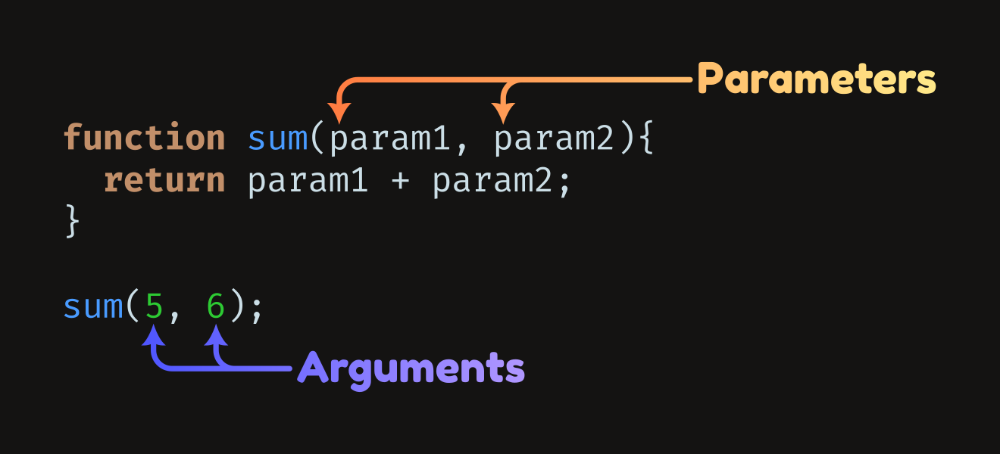

# [CS61A: Structure and Interpretation of Computer Programs](https://cs61a.org/)

###### TODO: Lab02、Homework02、Hog | 学习到 week03-9/9

## week3: 9/9

### Lab02: Higher-Order Functions, Lambda Expressions

#### argument vs. parameter
A parameter is a variable in a method definition. When a method is called, the arguments are the data you pass into the method's parameters.



#### Q4:Composite Identity Function
Write a function that takes in two single-argument functions, `f` and `g`, and returns another function that has a single parameter `x`. The returned function should return `True` if `f(g(x))` is equal to `g(f(x))` and `False` otherwise. You can assume the output of `g(x)` is a valid input for `f` and vice versa.

```Python
def composite_identity(f, g):
    """
    Return a function with one parameter x that returns True if f(g(x)) is
    equal to g(f(x)). You can assume the result of g(x) is a valid input for f
    and vice versa.

    >>> add_one = lambda x: x + 1        # adds one to x
    >>> square = lambda x: x**2          # squares x [returns x^2]
    >>> b1 = composite_identity(square, add_one)
    >>> b1(0)                            # (0 + 1) ** 2 == 0 ** 2 + 1
    True
    >>> b1(4)                            # (4 + 1) ** 2 != 4 ** 2 + 1
    False
    """
    "*** YOUR CODE HERE ***"
```
我的解题方法和更正：
```python
    '''
    # mine solution
    def h(x):
        a = f(g(x))
        b = g(f(x))
        if a == b:
            return True
        else:
            return False
    return h
    '''
    # cs61a's solution
    return lambda x: f(g(x)) == g(f(x))
    '''
    # alternate solution:
    def h(x):
        return f(g(x)) == g(f(x))
    return h
    '''
```

#### Q5: Count Cond
目的：实现count\_cond函数,它同时具有count\_fives和count\_primes函数的功能

感想：Higher-Order Functions返回函数，可以传入count\_fives或者count\_primes函数到count\_cond函数中来实现综合这两个函数的功能.

---------------------------

Consider the following implementations of count\_fives and count\_primes which use the sum\_digits and is\_prime functions from earlier assignments:
```python
def count_fives(n):
    """Return the number of values i from 1 to n (including n)
    where sum_digits(n * i) is 5.
    >>> count_fives(10)  # Among 10, 20, 30, ..., 100, only 50 (10 * 5) has digit sum 5
    1
    >>> count_fives(50)  # 50 (50 * 1), 500 (50 * 10), 1400 (50 * 28), 2300 (50 * 46)
    4
    """
    i = 1
    count = 0
    while i <= n:
        if sum_digits(n * i) == 5:
            count += 1
        i += 1
    return count

def count_primes(n):
    """Return the number of prime numbers up to and including n.
    >>> count_primes(6)   # 2, 3, 5
    3
    >>> count_primes(13)  # 2, 3, 5, 7, 11, 13
    6
    """
    i = 1
    count = 0
    while i <= n:
        if is_prime(i):
            count += 1
        i += 1
    return count
```
The implementations look quite similar! Generalize this logic by writing a function count\_cond, which takes in a two-argument predicate function condition(n, i). count\_cond returns a one-argument function that takes in n, which counts all the numbers from 1 to n that satisfy condition when called.
> Note: When we say condition is a predicate function, we mean that it is a function that will return True or False.

```python
def sum_digits(y):
    """Return the sum of the digits of non-negative integer y."""
    total = 0
    while y > 0:
        total, y = total + y % 10, y // 10
    return total

def is_prime(n):
    """Return whether positive integer n is prime."""
    if n == 1:
        return False
    k = 2
    while k < n:
        if n % k == 0:
            return False
        k += 1
    return True

def count_cond(condition):
    """Returns a function with one parameter N that counts all the numbers from
    1 to N that satisfy the two-argument predicate function Condition, where
    the first argument for Condition is N and the second argument is the
    number from 1 to N.

    >>> count_fives = count_cond(lambda n, i: sum_digits(n * i) == 5)
    >>> count_fives(10)   # 50 (10 * 5)
    1
    >>> count_fives(50)   # 50 (50 * 1), 500 (50 * 10), 1400 (50 * 28), 2300 (50 * 46)
    4

    >>> is_i_prime = lambda n, i: is_prime(i) # need to pass 2-argument function into count_cond
    >>> count_primes = count_cond(is_i_prime)
    >>> count_primes(2)    # 2
    1
    >>> count_primes(3)    # 2, 3
    2
    >>> count_primes(4)    # 2, 3
    2
    >>> count_primes(5)    # 2, 3, 5
    3
    >>> count_primes(20)   # 2, 3, 5, 7, 11, 13, 17, 19
    8
    """
    "*** YOUR CODE HERE ***"
```
我的解决方法和更正：
```python
    # same to cs61a's solution
    def f(n):
        count = 0
        i = 1
        while i <= n:
            if condition(n, i):
                count += 1
            i += 1
        return count
    return f
```

#### Q6: HOF Diagram Practice
Draw the environment diagram that results from executing the code below on paper or a whiteboard. Use [tutor.cs61a.org](https://tutor.cs61a.org/) to check your work.
```python
n = 7

def f(x):
    n = 8
    return x + 1

def g(x):
    n = 9
    def h():
        return x + 1
    return h

def f(f, x):
    return f(x + n)

f = f(g, n)
g = (lambda y: y())(f)
```

#### Q7: Multiple
目的：求最小公约数

感想：编程还是要靠数学，这题有两个点我不知道，一是最小公倍数等于两数之积除最小公约数，二是最小公约数可以用辗转相除法求得

更正后的感想：这题可以直接n一直加1，直到同时满足a, b取余都等于0就是最小的了，我怎么想的这么复杂......

---

Write a function that takes in two numbers and returns the smallest number that is a multiple of both.
```python
def multiple(a, b):
    """Return the smallest number n that is a multiple of both a and b.

    >>> multiple(3, 4)
    12
    >>> multiple(14, 21)
    42
    """
    "*** YOUR CODE HERE ***"
```
我的解决方法及更正：
```python
    # mine solution
    m ,n = a, b
    if a < b:
        temp = b
        b = a
        a = temp
    while(b != 0):
        temp = a % b
        a = b
        b = temp
    return m * n // a
    '''
    # cs61a's solution
    n = 1
    while True:
        if n % a == 0 and n % b == 0:
            return n
        n += 1
```

#### Q8: I Heard You Liked Functions...
感想：感觉还有更优的解法

---

Define a function cycle that takes in three functions f1, f2, and f3, as arguments. cycle will return another function g that should take in an integer argument n and return another function h. That final function h should take in an argument x and cycle through applying f1, f2, and f3 to x, depending on what n was. Here's what the final function h should do to x for a few values of n:

- n = 0, return x
- n = 1, apply f1 to x, or return f1(x)
- n = 2, apply f1 to x and then f2 to the result of that, or return f2(f1(x))
- n = 3, apply f1 to x, f2 to the result of applying f1, and then f3 to the result of applying f2, or f3(f2(f1(x)))
- n = 4, start the cycle again applying f1, then f2, then f3, then f1 again, or f1(f3(f2(f1(x))))
- And so forth.

Hint: most of the work goes inside the most nested function.
```python
def cycle(f1, f2, f3):
    """Returns a function that is itself a higher-order function.

    >>> def add1(x):
    ...     return x + 1
    >>> def times2(x):
    ...     return x * 2
    >>> def add3(x):
    ...     return x + 3
    >>> my_cycle = cycle(add1, times2, add3)
    >>> identity = my_cycle(0)
    >>> identity(5)
    5
    >>> add_one_then_double = my_cycle(2)
    >>> add_one_then_double(1)
    4
    >>> do_all_functions = my_cycle(3)
    >>> do_all_functions(2)
    9
    >>> do_more_than_a_cycle = my_cycle(4)
    >>> do_more_than_a_cycle(2)
    10
    >>> do_two_cycles = my_cycle(6)
    >>> do_two_cycles(1)
    19
    """
    "*** YOUR CODE HERE ***"
```
我的解决方法及更正：
```python
    def g(n):
        def h(x):
            '''
            # mine solution
            # 思想是一样的，但是我的代码写的太麻烦了
            result = x
            b = n
            if b >= 3:
                count = 3
            else:
                count = b

            while b > 0:
                result = f1(result)
                count -= 1
                if count >= 1:
                    result = f2(result)
                count -= 1
                if count >= 1:
                    result = f3(result)
                b -= 3
                if b >= 3:
                    count = 3
                else:
                    count = b
            return result
            '''
            # cs61a's solution
            i = 0
            while i < n:
                if i % 3 == 0:
                    x = f1(x)
                elif i % 3 == 1:
                    x = f2(x)
                else:
                    x = f3(x)
                i += 1
            return x
        return h
    return g
    '''
    # alternative recursive solution
    def g(n):
        def h(x):
            if n == 0:
                return x
            return cycle(f2, f3, f1)(n - 1)(f1(x))
        return h
    return g
    '''
```
